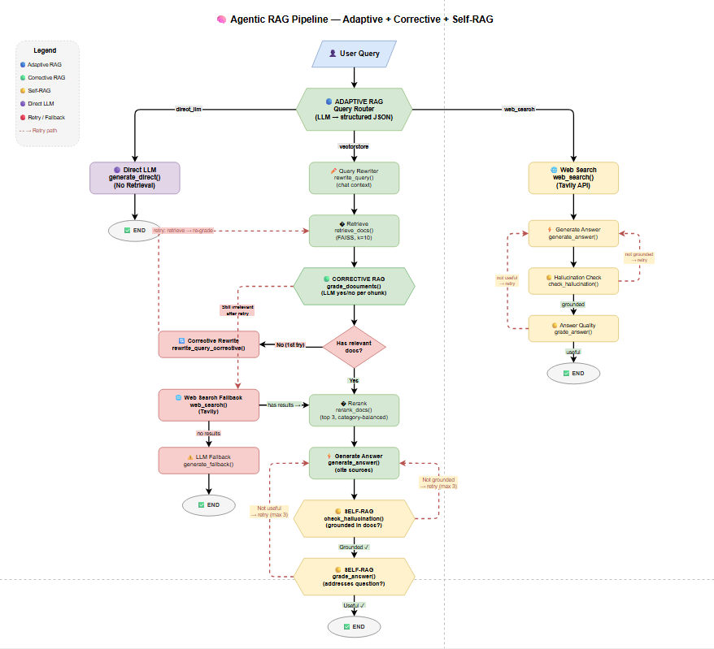

# 🧠 Agentic RAG Pipeline — Adaptive + Corrective + Self-RAG

**Assignment 3 — RAG Architect 2026**

An agentic RAG system that intelligently routes queries, grades retrieved documents, rewrites failed queries, falls back to web search, and self-checks answers for hallucinations and quality — all orchestrated as a custom Python state machine with no framework dependencies.

**Stack:** Custom Python pipeline · AWS Bedrock (Claude 3 Haiku + Titan Embeddings) · FAISS · Tavily

---

## Architecture

```

---

## Framework Choice: Why Custom Python (No LangGraph)

| Framework | Pros | Cons | Verdict |
|-----------|------|------|---------|
| **LangGraph** | Native state management, conditional edges, built-in retry limits | Heavy dependency, hides control flow, harder to debug | ❌ |
| **LlamaIndex** | Good for simple RAG, built-in retrievers | Less flexible for custom agentic loops | ❌ |
| **Custom Python** | Full control, explicit flow, easy to debug, zero lock-in | Must build state management manually | ✅ |

**Why custom Python:**
1. 12 nodes with conditional branching — plain `if/else` and `while` loops are clearer than a graph DSL.
2. State merging is a simple `_merge_state()` function — no `Annotated` reducers needed.
3. Loop control is explicit: `retry_count < max_retries`. No hidden `recursion_limit`.
4. Node functions are plain Python (dict → dict) — reusable with any orchestrator.
5. Standard Python debugger works — no graph compilation step.

---

## Chunking Strategy: Parent-Child + Semantic

**Parent-Child Chunking (default):**
- Parent chunks: 3000 chars / 500 overlap — broad context for the LLM
- Child chunks: 500 chars / 100 overlap — precise embedding search
- Retrieval searches children, parent context passed to LLM

**Semantic Chunking:**
- Embedding cosine similarity detects natural topic boundaries
- Variable-length chunks that respect semantic coherence
- Best for unstructured text where fixed-size splitting breaks mid-concept

Both strategies are implemented in `src/ingestion/chunker.py`.

---

## Design Trade-offs

1. **Quality vs Latency** — 5-7 LLM calls per query (~10-15s) vs 1 call for standard RAG (~3s). The quality improvement (catching bad retrievals and hallucinations) justifies the cost.

2. **Grader Prompt Framing** — Claude Haiku defaults to "no" on ambiguous yes/no. Using "should this doc be EXCLUDED?" instead of "is this relevant?" fixed false negatives.

3. **Multi-Category Retrieval** — Per-category FAISS search with balanced reranking prevents one category from dominating comparison queries.

4. **Conversational Context** — Query rewriter uses last 4 chat messages to resolve references ("explain the first one") before retrieval.

5. **Web Search Safety Net** — Tavily fallback when corrective rewrite + retry still fails.

6. **Loop Control** — Max 3 retries on hallucination/quality failures. `retry_count` increments on each failure; system always terminates gracefully.

---

## Project Structure

```
├── README.md                       # Setup + design decisions
├── requirements.txt                # Python dependencies
├── .env.example                    # Environment variables template
├── main.py                         # Streamlit UI (entry point)
├── src/
│   ├── graph.py                    # Full pipeline assembly (custom state machine)
│   ├── ingestion/
│   │   ├── loader.py               # Document scanner + text extractor (PDF, DOCX, MD, HTML, TXT)
│   │   ├── chunker.py              # Chunking strategies (parent-child, semantic, basic)
│   │   └── indexer.py              # FAISS vector store create/save/load
│   └── nodes/
│       └── nodes.py                # Router, retriever, grader, rewriter, generator, fallback
├── vector_store/                   # Persisted FAISS index
│   ├── index.faiss
│   └── index.pkl
└── knowledge-base/                 # Source documents (≥3 docs per category)
    ├── avaya/                      # Avaya call center module (9 files)
    ├── bppsl/                      # Booking/fare proration (9 files)
    └── dot/                        # DOT fare/currency (10 files)
```

---

## Quick Start

```bash
pip install -r requirements.txt
cp .env.example .env
# Edit .env with your AWS credentials and optionally TAVILY_API_KEY
```

### Streamlit UI

```bash
streamlit run main.py
```

The Streamlit app provides a chat interface that demonstrates all 3 pipeline branches with source citations:
- Branch 1: Vectorstore retrieval (Adaptive → Corrective → Self-RAG)
- Branch 2: Direct LLM (no retrieval)
- Branch 3: Web search fallback (Tavily)

Agent trace is visible in the UI for each query.

---

## Tech Stack

| Component | Technology |
|-----------|-----------|
| LLM | AWS Bedrock — Claude 3 Haiku |
| Embeddings | AWS Bedrock — Amazon Titan Embed Text v1 |
| Vector Store | FAISS (faiss-cpu) |
| Framework | Custom Python (no LangGraph) |
| Web Search | Tavily |
| Orchestration | LangChain (minimal — prompts + Bedrock client) |

---

## References

- [Self-RAG — Asai et al., 2023](https://arxiv.org/abs/2310.11511)
- [Corrective RAG — Yan et al., 2024](https://arxiv.org/abs/2401.15884)
- [Adaptive RAG — Jeong et al., 2024](https://arxiv.org/abs/2403.14403)
- [LangGraph Agentic RAG Tutorial](https://langchain-ai.github.io/langgraph/tutorials/rag/langgraph_agentic_rag/) (reference studied, not copied)
